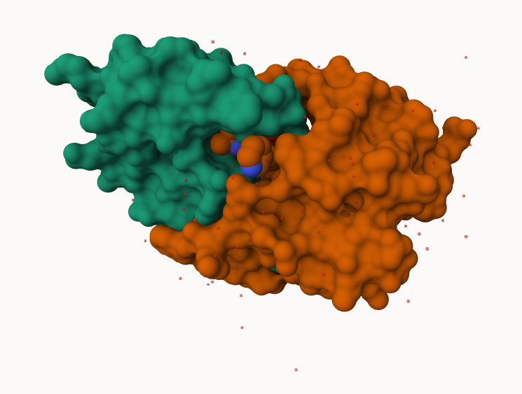
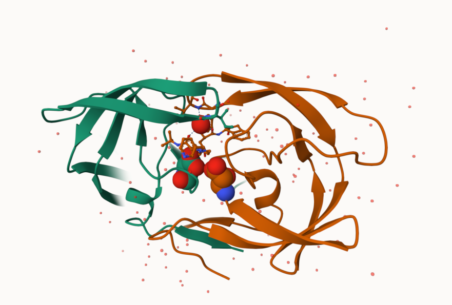

## PDB Statistics 

The Protein Data Bank (PDB) is the main repository of biomolecular structures. Let's see what it contains:


```{r}
stats <- read.csv("Data Export Summary.csv")
stats
```
```{r}
stats$X.ray 
```
```{r}
sum( stats$Neutron )
```
The comma in these numbers leads to the numbers here being read as chracter.

> Q1: What percentage of structures in the PDB are solved by X-Ray and Electron Microscopy.

```{r}
library(readr)
stats <- read_csv("Data Export Summary.csv")
stats
```


```{r}
n.xray <- sum(stats$`X-ray`)
n.total <- sum(stats$`Total`)

n.xray/n.total
```

> Q2: What proportion of structures in the PDB are protein?

```{r}

```

> Q3 Skip...

## Visualizing the HIV-1 protease structure

We can use the Molstar viewer online: https://molstar.org/viewer/




A new clean image showing the catalytic ASP25 amino acids in both chains of HIV-Pr dimer along with the inhibitor and all important active site water.




## Bio3d package for structural bioinformatics

```{r}
library(bio3d)

pdb <- read.pdb("1hsg")
pdb
```

> Q7: How many amino acid residues are there in this pdb object? 

There are 128 amino acid residues in this object

> Q8: Name one of the two non-protein residues? 

Mk1 residue

> Q9: How many protein chains are in this structure?

There are 2 protein chains in the structure

```{r}
head(pdb$atom)
```

```{r}
#library(bio3dview)


#view.pdb(pdb)
```

```{r}
# Select the important ASP 25 residue
sele <- atom.select(pdb, resno=25)

# and highlight them in spacefill representation
#view.pdb(pdb, cols=c("navy","teal"), 
        # highlight = sele,
        # highlight.style = "spacefill") |>
  #setRock()
```

## Predicting functional motions of a single structure

Read an ADK structure from the PDB database

```{r}
adk <- read.pdb("6s36")
adk
```

```{r}
m <- nma(adk)
plot(m)
```

Write out our results as a wee trajectory/movie of predicted motions:

```{r}
mktrj(m, file="adk_m7.pdb")
```


## Comparitive Analysis with PCA


First step find an ADK sequence:

```{r}
library(bio3d)
id <- "1ake_A" ## Change this to run a different analysis
aa <- get.seq( id )
```

```{r}
aa
```

Next step, is search the PDB database for all related entries:

```{r}
blast <- blast.pdb(aa)
hits <- plot(blast)
```

All the BLAST results are here for us to see:
```{r}
head( blast$hit.tbl )
```

The "top hits" are in the `hits` object. Now we can download these to our computer. Put these in  a wee sub-folder called "pdbs" and use gzip to speed things up

```{r}
# Download related PDB files
files <- get.pdb(hits$pdb.id, path="pdbs", split=TRUE, gzip=TRUE)
```

These look like a hot mess


Next we will use `pdbaln()` function to align and also optionally fit (i.e. superpose) the identified PDB structures

This requires a BioConductor package called "msa" that we need to install. First we install BiocManager. Then we use `BiocManager::install("msa")`

```{r}
# Align releated PDBs
pdbs <- pdbaln(files, fit = TRUE, exefile="msa")

```

Have a wee peak at this new "alignment object" `pdbs`

```{r}
pdbs
```

We could view these in R with **bio3dview** `view.pdbs()` function.

```{r}
# library(bio3dview)
# view.pdbs(pdbs, colorScheme = "residue")
```

## PCA 

We can run PCA on our `pdbs` object using the `pca()` function from **bio3d**:

```{r}
pc.xray <- pca(pdbs)
plot(pc.xray)
```

```{r}
plot(pc.xray, 1:2)
```

We can make a visualization of the major conformational difference (i.e. large scale structure change) captured by our PCA analysis with the `mktrj()` function

```{r}
pc1 <- mktrj(pc.xray, file="pca.pdb")
```

Let's see in Molstar


